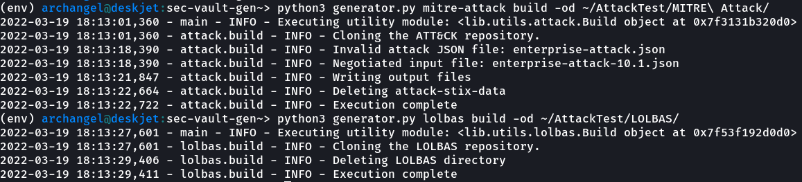
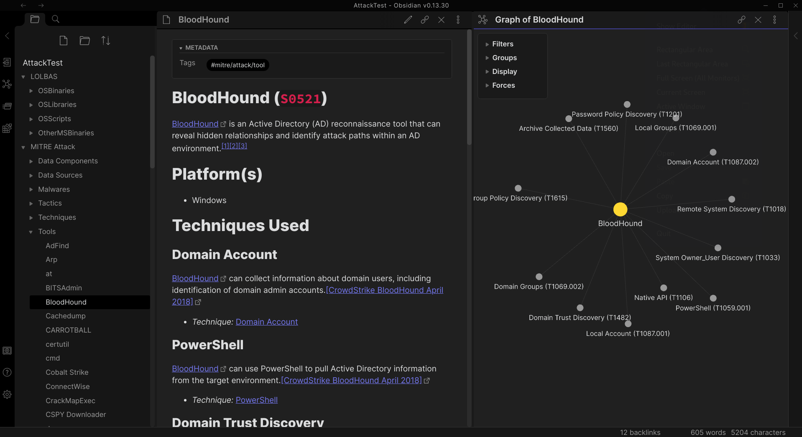
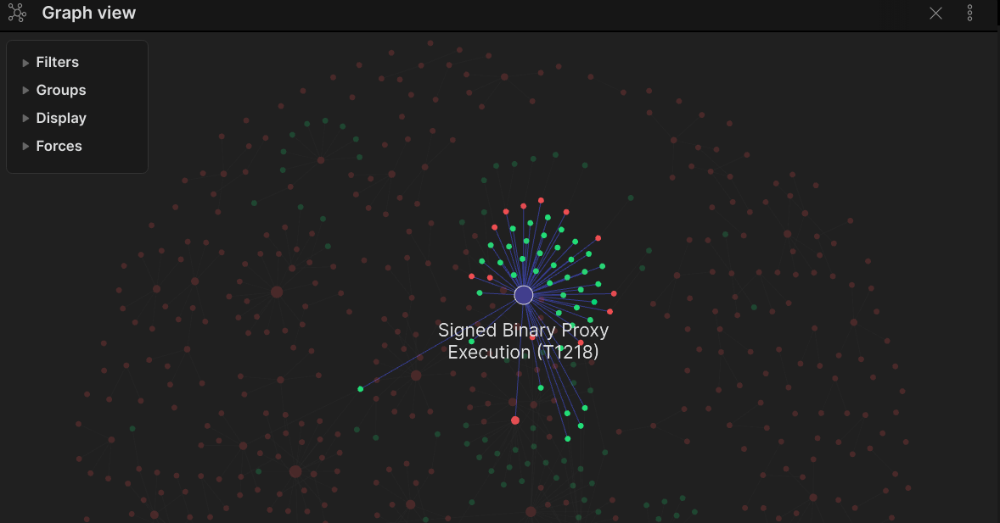

# Security Vault Generator

Quickly parse, format, and output common frameworks/content for [Obsidian.md](https://obsidian.md).

There is a strong focus on MITRE ATT&CK because it provides a solid and generally
accepted framework that can be used to bind notes to.

I ripped this out in 1-2 days so it's only at minimum viable product.

*This should have been an Obsidian plugin but I didn't want to JS.*

# Docs

- [Installation](docs/Installation.md)
- [Linking Back to MITRE ATT&CK](docs/Linking%20Back%20to%20MITRE%20ATT%26CK.md)

# Quickstart

_This assumes all packages have been installed via PIP. See [Installation](docs/Installation.md)
for steps on this process._

Just execute the proper `build` subcommand and `generator.py` will:

1. Clone necessary repositories.
2. Parse all artifacts.
3. Embed frontmatter with tagging.
4. Format them to `.md` files.
5. And dump the files to disk in a directory of your choice.

Assuming your vault is named `TheVault`, these commands should work
to build out the MITRE ATT&CK framework and LOLBAS:

**Tip:** Select a directory in the target Obsidian vault  as an output directory using the `-od` flag
for each subcommand.

```bash
python3 generator.py mitre-attack build -od ~/TheVault/MITRE\ Attack/
python3 generator.py lolbas build -od ~/TheVault/LOLBAS/
python3 generator.py mitre-attack link --attack-directory ~/TheVault/MITRE\ Attack/
```



Now all you have to do is open the vault in Obsidian:



Engaging "graph view" and applying a filter with group colors on tags should yield
output similar to the following, where green nodes are LOLBAS notes and red are
MITRE ATT&CK:



*Tip:* Here's the filter I used. You'll have to go about grouping by isolating the tags.

```
tag:#lolbas OR tag:#mitre/attack/technique
```
